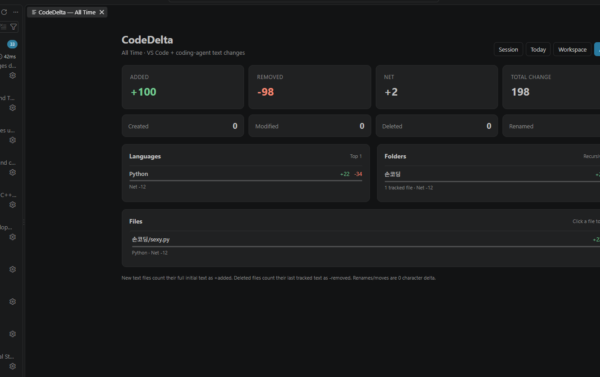

# CodeDelta

**See how much your code actually changes.**

CodeDelta is a lightweight VS Code extension that tracks development-focused text changes from both **VS Code** and external coding tools such as **Codex** and **Claude Code**.

It records added/removed characters, file activity, language totals, folders, files, multiple time scopes, and Git-aware activity boundaries without requiring a cloud service.



## Highlights

- Separate `+added` and `-removed` counters in the VS Code status bar.
- Compact bottom panel for quick stats and a full dashboard for deeper breakdowns.
- Session, Today, Workspace, and All Time scopes.
- Per-language, per-folder, and per-file statistics.
- Tracks created, edited, deleted, and renamed files.
- New text files count their full initial text as added characters.
- Deleted tracked text files count their last known text as removed characters.
- Renames/moves contribute zero character delta.
- Tracks edits applied inside VS Code by formatters, refactors, extensions, and coding agents.
- Optional on-disk watcher tracks direct external edits from CLI tools and coding agents.
- Bounded snapshot cache and visible tracking-health state to avoid silent partial coverage.
- Fixed **Development** policy: source code, project config/build files, and project documentation are counted; generic text/data and common generated artifacts are ignored.
- **Git Awareness** shows CodeDelta-observed activity since the current repository HEAD boundary.
- Multi-repository workspaces keep independent Git checkpoints and histories.

## What it looks like

The main status bar stays minimal:

```text
✎ +12.4k    ✎ -3.1k
```

When Git Awareness is available, CodeDelta also exposes a commit-boundary counter:

```text
◉ +4.2k -1.2k
```

Click the main counters to open the compact CodeDelta panel. The same bottom-panel container also includes a **Git Awareness** view with repository, branch, HEAD, Since Commit activity, and recent observed boundaries.

Use **Full dashboard** for detailed language, folder, file, activity, and total breakdowns, or run **CodeDelta: Open Git Dashboard** for Git-focused activity.

## Git Awareness

CodeDelta v0.6 adds a Git-aware layer without replacing the existing tracking engine.

The important distinction is:

> **Git shows the repository diff. CodeDelta shows the development activity it actually observed.**

For each Git repository detected by VS Code, CodeDelta stores a checkpoint of its cumulative Workspace counter for the current HEAD. The displayed **Since Commit** value is the observed counter difference after that checkpoint.

When HEAD changes, CodeDelta:

1. waits briefly for the core development counters to settle and persist;
2. records the previous HEAD's observed CodeDelta activity when there is meaningful activity;
3. creates a new checkpoint for the new HEAD;
4. resets only that repository's Since Commit view.

This supports ordinary commits as well as HEAD changes caused by checkout, reset, or rebase. The history is intentionally described as **observed HEAD boundaries** rather than pretending every transition is a normal commit.

### Multi-repository workspaces

If a VS Code workspace contains multiple Git repositories, CodeDelta assigns each tracked file to the most specific containing repository root. Each repository gets an independent:

- HEAD and branch context;
- Since Commit checkpoint;
- activity counter;
- recent boundary history.

Nested repositories therefore do not intentionally double-count the same file in parent and child Git counters.

### Git checkpoint behavior

The first time v0.6 observes a repository HEAD, the current CodeDelta Workspace state becomes the baseline for that HEAD. CodeDelta does not reconstruct pre-v0.6 historical typing activity from `git diff`.

If the user explicitly resets the core Workspace counter and the cumulative data becomes non-monotonic, Git Awareness rebases its checkpoint to the new counter rather than leaving Since Commit stuck behind an unreachable old baseline.

Use **CodeDelta: Reset Git Checkpoint** to manually rebase the current Git checkpoints without resetting the main Session/Today/Workspace/All Time counters.

Git integration uses VS Code's built-in Git extension API. If that API is unavailable, the main CodeDelta tracker continues to work normally and the Git-specific UI degrades gracefully.

## Counting rules

| Change | CodeDelta behavior |
| --- | --- |
| Type/edit text in VS Code | Counts the actual inserted/removed text |
| Formatter/refactor/agent edit in VS Code | Counts through VS Code document changes |
| New external text file | Entire initial text counts as `+added` once |
| Deleted tracked text file | Last cached text counts as `-removed` |
| Rename/move | `0` character delta; rename activity increments |
| Direct CLI/agent disk edit | Diffed against the tracked disk baseline |
| Git HEAD changes | Close the old observed Git boundary and create a new Since Commit checkpoint |

### Development files

Counted examples include source code, JSON/YAML/TOML/XML, `.env*`, Dockerfile, Makefile/CMake, Terraform, `package.json`, `pyproject.toml`, Markdown/MDX, README, CHANGELOG, CONTRIBUTING, and similar development files.

Ignored examples include arbitrary notes, CSV/log files, binary/media/archive files, common generated lockfiles, minified JS/CSS, source maps, and excluded build/dependency directories.

## Install from VSIX

Until CodeDelta is published to the VS Code Marketplace:

1. Download the `.vsix` from the GitHub **Releases** page.
2. In VS Code, open **Extensions**.
3. Open the `...` menu and choose **Install from VSIX...**.
4. Select the downloaded file.

## Development

No runtime npm dependencies are required by the extension.

```bash
npm test
```

For interactive testing, open this repository in VS Code and press `F5` to launch an Extension Development Host.

The v0.6 entry point is `bootstrap.js`, which activates the existing tracking core and the Git Awareness addon as separate layers.

## Configuration

Useful settings include:

- `codeDelta.displayScope` — main status-bar scope (`session`, `today`, `workspace`, `allTime`).
- `codeDelta.showIcon` — show/hide the main edit icons.
- `codeDelta.showGitStatus` — show/hide the Git Since Commit status item.
- `codeDelta.gitHistoryLimit` — observed Git boundary records retained per repository (default `30`).
- `codeDelta.exclude` — glob-like path exclusions.
- `codeDelta.trackExternalChanges` — enable direct on-disk change tracking.
- `codeDelta.externalMaxFileBytes` — per-file external snapshot limit.
- `codeDelta.externalMaxFiles` — maximum external files to snapshot.
- `codeDelta.externalSnapshotBudgetBytes` — total snapshot memory budget.

When snapshot coverage hits a configured limit, the UI reports **Partial** instead of silently pretending full coverage.

## Privacy

CodeDelta's statistics and Git checkpoints are stored locally through VS Code extension storage. The extension does not need to upload source code, Git history, or statistics to a remote service to provide its current functionality.

## Current status

**v0.6.0 — Git Awareness beta**

The existing v0.5 tracking core remains intact while v0.6 adds local Git context, per-repository HEAD checkpoints, Since Commit activity, recent observed boundary history, Git status UI, and Git dashboards.

See [CHANGELOG.md](CHANGELOG.md) for details.

## Roadmap

Potential next steps:

- richer per-boundary language/file breakdowns;
- local branch/commit labels and optional commit-message capture;
- daily/weekly activity history and heatmaps;
- optional GitHub / pull-request integration;
- explicit per-PR CodeDelta activity summaries.

## License

MIT. See [LICENSE](LICENSE).
